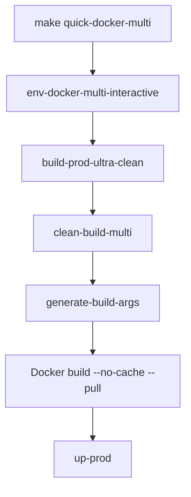

# Docker Layer Corruption Fix for Multi-Host Deployment (Subproject 3)

## Problem Summary

Docker layer corruption issues were affecting **subproject 3 (Multi-host deployment)** triggered by `make quick-docker-multi`. This manifested as Docker build errors during backend image export, typically showing:
- "layer corruption during export" 
- "snapshot corruption issues"
- Failed container builds despite code being correct

## Root Cause

The issue was caused by:
1. **Insufficient cache invalidation** in the backend Dockerfile
2. **Stale Docker layers** being reused inappropriately 
3. **Missing cache-busting mechanisms** in the backend build process
4. **Layer state inconsistencies** between Docker daemon snapshots

## Solution Implemented

### 🔧 Backend Dockerfile Enhancements

**File: `docker/backend/Dockerfile`**

- **Added cache-busting arguments**: `BUILD_DATE`, `GIT_COMMIT`, `CACHE_BUST`
- **Implemented cache invalidation layer**: Forces rebuild when source files change
- **Enhanced build verification**: Comprehensive logging and output validation
- **Added build info persistence**: Debug information available at runtime
- **Improved multi-stage structure**: Proper layer separation and optimization

### 🛠️ Makefile Build System Updates

**File: `Makefile`**

- **New `build-prod-ultra-clean` target**: Comprehensive cleanup before building
- **Enhanced `quick-docker-multi`**: Now uses ultra-clean build process
- **Added `clean-build-multi` target**: Removes cached layers and build artifacts
- **New `ultra-clean-multi` alias**: Easy access to comprehensive cleanup
- **Uses `--pull` flag**: Ensures fresh base images are always used

### 📜 Ultra-Clean Build Script

**File: `scripts/ultra-clean-build-multi.sh`**

- **Step-by-step cleanup process**: Systematic removal of problematic layers
- **Fresh build argument generation**: Unique timestamps and source hashing
- **Comprehensive verification**: Build success validation and image verification
- **Detailed logging**: Clear progress indication and debugging information
- **Error handling**: Robust error checking and meaningful error messages

## Usage Instructions

### Quick Start (Recommended)

For **subproject 3 (Multi-host deployment)**, simply run:

```bash
make quick-docker-multi
```

This now automatically:
1. Sets up multi-host environment configuration
2. Performs ultra-clean build (prevents layer corruption)
3. Starts the production environment

### Manual Ultra-Clean Build

If you need to perform an ultra-clean build manually:

```bash
# Option 1: Use Makefile target
make build-prod-ultra-clean

# Option 2: Use script directly
./scripts/ultra-clean-build-multi.sh

# Option 3: Clean then build
make clean-build-multi
make build-prod-clean
```

### Troubleshooting Existing Issues

If you're experiencing Docker layer corruption:

```bash
# Step 1: Stop all containers
make stop

# Step 2: Ultra-clean all cached layers
make ultra-clean-multi

# Step 3: Rebuild with fresh layers
make build-prod-ultra-clean

# Step 4: Start the environment
make up-prod
```

## Technical Details

### Cache-Busting Mechanism

The solution implements a multi-layered cache-busting approach:

1. **Source File Hashing**: Generates MD5 hash of source files
2. **Git Commit Integration**: Uses git commit SHA for versioning
3. **Timestamp Generation**: Unique build timestamps prevent stale layers
4. **Build Argument Integration**: Arguments passed to Docker invalidate cached layers

### Build Process Flow



### Cache Invalidation Points

The system strategically places cache invalidation at:

1. **Build argument layer**: Changes to build args invalidate subsequent layers
2. **Source copy layer**: Changes to source files trigger rebuild
3. **Dependencies layer**: Changes to package files force dependency reinstall
4. **Base image layer**: `--pull` ensures fresh base images

## Best Practices for Subproject 3

### Always Use Clean Builds

For **subproject 3 (Multi-host deployment)**, prioritize clean builds:

```bash
# ✅ Good: Always clean for multi-host
make quick-docker-multi

# ⚠️ Use with caution: May have stale layers
make build-prod && make up-prod
```

### Monitor Build Output

Watch for these indicators of successful clean builds:

```
✅ Ultra-clean build for multi-host deployment...
✅ Using build arguments: BUILD_DATE=... GIT_COMMIT=... CACHE_BUST=...
✅ Backend build completed successfully
✅ Docker layer corruption prevention: SUCCESS
```

### Environment-Specific Notes

**Multi-host deployment** requires special attention because:
- External services (MongoDB, Ollama) increase complexity
- Network configuration must be fresh
- Service discovery settings need clean state
- Cross-host communication requires consistent builds

## Verification

After implementing the fix, verify success:

1. **Check build info**:
   ```bash
   docker exec olympian-backend cat /app/build_info.txt
   ```

2. **Verify fresh images**:
   ```bash
   docker images | grep olympian
   # Should show recent timestamps
   ```

3. **Test deployment**:
   ```bash
   make status
   # All containers should be running
   ```

## Maintenance

### Regular Cleanup (Weekly)

```bash
# Clean up accumulated cache
make clean-build-multi

# Remove old images
docker image prune -f
```

### Monitoring Build Performance

Track build times to ensure the solution is working:
- **First build**: Should take 5-15 minutes (full build)
- **Subsequent clean builds**: Should take 3-8 minutes
- **Cached builds**: Should take 1-3 minutes (when appropriate)

## Related Documentation

- [Docker Build Cache Best Practices](https://docs.docker.com/build/cache/)
- [Multi-stage Build Optimization](https://docs.docker.com/build/building/multi-stage/)
- [Deployment Guide](./DEPLOYMENT_GUIDE.md)
- [Quick Reference](./QUICK_REFERENCE.md)

---

**Note**: This solution specifically addresses **subproject 3 (Multi-host deployment)**. Other subprojects (same-host deployments) use different build processes and are not affected by this fix.
