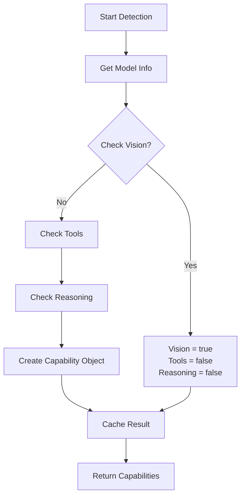

# Model Capabilities Detection and Display Logic

## Overview

Olympian AI Lightweight automatically detects and classifies model capabilities to provide users with appropriate functionality and prevent compatibility issues. The system identifies three main types of capabilities:

- **Vision** 👁️ - Ability to process and understand images
- **Tools** 🔧 - Ability to call functions and use external tools
- **Reasoning** 🧠 - Advanced logical reasoning and step-by-step thinking

## Capability Rules: Exclusivity vs Inclusivity

### Vision is EXCLUSIVE
- **Rule**: If a model has vision capabilities, it cannot have tools or reasoning capabilities
- **Logic**: `vision: true` → `tools: false, reasoning: false`
- **Rationale**: Vision models are typically specialized for multimodal tasks and don't support function calling or complex reasoning workflows

### Tools and Reasoning are INCLUSIVE
- **Rule**: Non-vision models can have both tools AND reasoning capabilities simultaneously
- **Logic**: `vision: false` → `tools: true/false, reasoning: true/false` (independent of each other)
- **Rationale**: Modern language models can excel at both function calling and reasoning tasks

## Capability Detection Logic

### 1. Vision Detection

Vision capability detection uses multiple methods to ensure comprehensive coverage:

#### Detection Methods (in order of reliability):

1. **Modalities Field** (Most Reliable)
   ```json
   {
     "modalities": ["vision", "multimodal", "image", "visual"]
   }
   ```

2. **Config Modalities**
   ```json
   {
     "config": {
       "modalities": ["vision", "image"]
     }
   }
   ```

3. **Capabilities Field**
   ```json
   {
     "capabilities": {
       "image_processing": true
     }
   }
   ```

4. **Vision Components**
   ```json
   {
     "config": {
       "vision_encoder": {...},
       "image_processor": {...}
     }
   }
   ```

5. **Architecture Patterns**
   - Detected patterns: `vision`, `clip`, `vit`, `llava`, `bakllava`, `moondream`, `multimodal`, `cogvlm`, etc.

6. **Model Families**
   - Detected families: `llava`, `minicpm-v`, `qwen-vl`, `internvl`, `deepseek-vl`, etc.

7. **Modelfile Inspection**
   - Patterns: `vision_encoder`, `image_processor`, `clip_model`, `vision_tower`, etc.

8. **Name Pattern Matching** (Fallback)
   - Patterns: `llava`, `llama3.2-vision`, `phi-3-vision`, `qwen.*vision`, etc.

### 2. Tools Detection

Tools detection identifies models capable of function calling:

#### Detection Methods:

1. **Known Tool-Capable Models**
   ```typescript
   const knownToolModels = [
     'mistral', 'mixtral', 'llama3.1', 'llama-3.1', 'llama3.2', 
     'qwen2.5', 'gemma2', 'command-r', 'firefunction', 'hermes',
     'dolphin', 'codegemma', 'codellama', 'deepseek-coder',
     'nous-hermes', 'openchat', 'vicuna', 'wizard', 'orca'
   ];
   ```

2. **Modelfile Indicators**
   - Keywords: `TOOLS`, `function`, `tool_use`, `function_calling`

3. **Description Analysis**
   - Keywords: `function`, `tool`, `api`

### 3. Reasoning Detection

Reasoning detection identifies models with advanced logical capabilities:

#### Detection Methods:

1. **Known Reasoning Models**
   ```typescript
   const knownReasoningModels = [
     'deepseek-r1', 'llama3.1-intuitive-thinker', 'qwen-qwq', 
     'o1', 'o1-mini', 'claude-3-opus', 'gpt-4-turbo',
     'gemini-1.5-pro', 'mistral-large', 'qwq', 'qwen2.5',
     'llama3.1', 'mixtral', 'nous-hermes', 'wizard', 'dolphin'
   ];
   ```

2. **Metadata Indicators**
   - Families: `reasoning`, `chain-of-thought`, `cot`, `step-by-step`
   - Description: `logical`, `analytical`, `problem-solving`, `thinking`

3. **Modelfile Analysis**
   - Keywords: `reasoning`, `instruct`, `chat`, `analysis`

## Detection Process Flow



## Capability Object Structure

```typescript
interface ModelCapability {
  name: string;           // Model name
  vision: boolean;        // Vision capability
  tools: boolean;         // Function calling capability
  reasoning: boolean;     // Advanced reasoning capability
  maxTokens: number;      // Maximum output tokens
  contextWindow: number;  // Context window size
  description?: string;   // Model description
}
```

## Examples of Capability Classifications

### Vision Model (Exclusive)
```json
{
  "name": "llava:13b",
  "vision": true,
  "tools": false,
  "reasoning": false,
  "maxTokens": 4096,
  "contextWindow": 4096,
  "description": "Large Language and Vision Assistant"
}
```

### Tools + Reasoning Model (Inclusive)
```json
{
  "name": "llama3.1:8b",
  "vision": false,
  "tools": true,
  "reasoning": true,
  "maxTokens": 4096,
  "contextWindow": 128000,
  "description": "Advanced language model with function calling"
}
```

### Tools Only Model
```json
{
  "name": "mistral:7b",
  "vision": false,
  "tools": true,
  "reasoning": false,
  "maxTokens": 4096,
  "contextWindow": 32768
}
```

### Reasoning Only Model
```json
{
  "name": "qwen-qwq:32b",
  "vision": false,
  "tools": false,
  "reasoning": true,
  "maxTokens": 4096,
  "contextWindow": 32768
}
```

## UI Display Logic

### Model Selection Interface

The UI displays model capabilities using visual indicators:

- **👁️ Vision Icon**: Shows for vision-capable models
- **🔧 Tools Icon**: Shows for tool-capable models  
- **🧠 Reasoning Icon**: Shows for reasoning-capable models

### Display Rules

1. **Vision Models**: Only show vision icon (exclusive)
2. **Non-Vision Models**: Show tools and/or reasoning icons as applicable
3. **Multi-Capability Models**: Show multiple icons for tools + reasoning combinations

### Example UI Representations

```
llava:13b              [👁️]
llama3.1:8b           [🔧🧠]
mistral:7b            [🔧]
qwen-qwq:32b          [🧠]
phi3:mini             [ ] (no special capabilities)
```

## Performance Considerations

### Caching Strategy

- **Cache Duration**: Capabilities are cached indefinitely until manual refresh
- **Cache Key**: Model name
- **Cache Invalidation**: Manual via `clearCapabilityCache()` method

### Fast Detection Methods

The system uses "fast" detection methods that avoid actual API testing:

- **Pattern Matching**: Fast string matching against known patterns
- **Metadata Analysis**: Quick inspection of model metadata
- **Known Model Lists**: Instant lookup for recognized models

### Concurrent Detection

- **Concurrency Limit**: 3 models processed simultaneously
- **Progress Tracking**: Detection progress is tracked and logged
- **Error Handling**: Failed detections don't stop other model processing

## Troubleshooting

### Common Issues

1. **Model Misclassified**
   - **Cause**: New model not in known patterns
   - **Solution**: Add model patterns to detection arrays
   - **Temporary Fix**: Clear cache and re-detect

2. **Vision Model Shows Tools/Reasoning**
   - **Cause**: Logic error or caching issue
   - **Solution**: Check logs for validation warnings
   - **Debug**: Look for "Logic error" messages in logs

3. **Tools/Reasoning Not Detected**
   - **Cause**: Model patterns not comprehensive enough
   - **Solution**: Update detection patterns
   - **Workaround**: Manual model classification

### Debug Commands

```bash
# Clear capability cache for specific model
# (requires API call to clear cache endpoint)

# View detection logs
docker logs olympian-backend | grep "Capability detection"

# Check cached capabilities
# (inspect memory via debugging tools)
```

### Log Messages to Watch

```
✅ Capability detection completed for model 'X' in Yms:
❌ Failed to detect capabilities for model X after Yms:
⚠️ Logic error: Vision model 'X' incorrectly detected with tools/reasoning
```

## Configuration

### Environment Variables

- `LOG_LEVEL`: Set to `debug` for detailed capability detection logs
- `OLLAMA_HOST`: Affects which Ollama instance is queried for model info

### Deployment-Specific Behavior

- **Subproject 1 & 2**: Same-host deployments use local Ollama
- **Subproject 3**: Multi-host deployment may use remote Ollama instances

## API Endpoints

### Get Model Capabilities
```http
GET /api/models/capabilities
```

Returns array of all detected model capabilities.

### Get Specific Model Capability
```http
GET /api/models/:modelName/capabilities
```

Returns capability object for specific model.

### Clear Capability Cache
```http
POST /api/models/capabilities/clear
```

Clears capability cache (may require implementation).

## Best Practices

1. **Monitor Detection Logs**: Watch for detection failures or logic errors
2. **Update Patterns Regularly**: Add new model patterns as they become available
3. **Test New Models**: Verify capability detection for newly added models
4. **Clear Cache When Needed**: Clear cache after model updates or configuration changes

## Future Enhancements

### Planned Improvements

1. **Dynamic Pattern Updates**: Allow runtime pattern updates without code changes
2. **User Override**: Allow manual capability overrides for specific models
3. **Performance Metrics**: Track detection success rates and timing
4. **Advanced Testing**: Implement actual capability testing for uncertain cases

### Extensibility

The capability detection system is designed to be extensible:

- **New Capability Types**: Add new capability types beyond vision/tools/reasoning
- **Custom Detection Methods**: Implement custom detection logic for specific use cases
- **Plugin Architecture**: Support for third-party capability detectors
