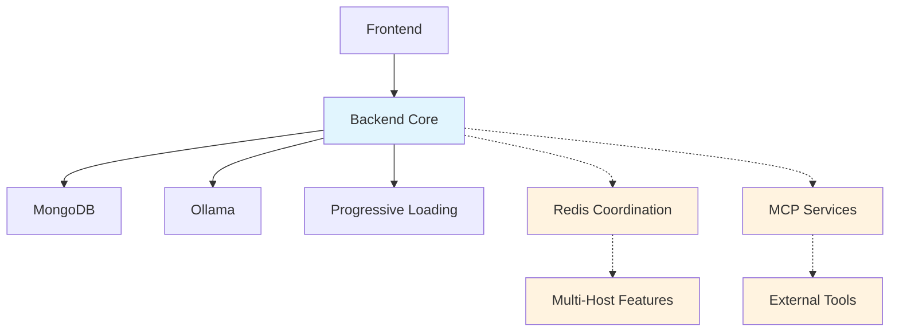

# Subproject 3 Multi-Host Deployment - Separation of Concerns

This document explains the fixes implemented for subproject 3 to ensure proper separation of concerns between MCP capabilities and core model functionality.

## Problem Statement

The introduction of MCP capabilities was blocking access to models in subproject 3 (Multi-host deployment). Issues included:

1. **MCP servers requiring Python `uv/uvx` tools** not available in Docker containers
2. **MCP initialization failures** preventing entire server startup
3. **Poor separation of concerns** between MCP and core model functionality
4. **Redis dependency failures** for multi-host coordination

## Solution Overview

### 1. Separation of Services

Services are now initialized in the following order with proper separation:

```
Core Services (Essential)
├── Database (MongoDB)
├── Artifacts Collection
├── Ollama Health Check
├── Connection Scanner
└── Progressive Model Loading

Optional Services (Non-blocking)
├── Multi-Host Coordination (Redis)
└── MCP Services (Tool Integration)

WebSocket & API (Dependent on Core)
├── WebSocket Service
└── API Routes
```

### 2. Environment Variables

#### Core Configuration
- `DEPLOYMENT_MODE=multi-host` - Enables multi-host features
- `ENABLE_MULTI_HOST=true` - Enables multi-host coordination

#### MCP Configuration (Optional)
- `MCP_ENABLED=true` - Enable/disable MCP completely (default: true)
- `MCP_OPTIONAL=true` - Continue without MCP if it fails (default: true)

#### Redis Configuration (Optional)
- `REDIS_URL=redis://redis:6379` - Redis connection (optional)
- `REDIS_OPTIONAL=true` - Continue without Redis if unavailable (default: true)

### 3. MCP Server Configuration

The `mcp-config.multihost.json` has been cleaned up:

#### Removed Servers (Require Python)
- `applescript_execute` - Required `uv` Python package manager
- `basic-memory` - Required `uvx` Python package manager

#### Remaining Servers (Docker Compatible)
- `met-museum` - Metropolitan Museum API (Node.js)
- `nasa-mcp` - NASA APIs (Node.js)
- `github` - GitHub integration (Node.js)
- `Context7` - Documentation context (Node.js)

All remaining servers are marked as `optional: true`.

### 4. Docker Compose Profiles

Services are organized using Docker profiles:

```bash
# Basic deployment (core services only)
docker-compose -f docker-compose.prod.yml up

# With Redis coordination
docker-compose -f docker-compose.prod.yml --profile redis up

# With MCP services
docker-compose -f docker-compose.prod.yml --profile mcp up

# Full deployment (all services)
docker-compose -f docker-compose.prod.yml --profile full up
```

## Service Health Guarantees

### Core Services ✅ Must Work
- Database connection to MongoDB
- Ollama health checking and model access
- Artifact collection and storage
- Progressive model loading
- WebSocket connections
- API endpoints

### Optional Services ⚠️ May Fail
- Redis coordination (fallback to single-instance mode)
- MCP tool integration (fallback to no external tools)
- Multi-host monitoring (fallback to basic monitoring)

## Troubleshooting

### Server Won't Start

1. **Check core services first:**
   ```bash
   # Check if MongoDB is accessible
   docker logs olympian-mongodb
   
   # Check if Ollama host is reachable
   curl -f $OLLAMA_HOST/api/tags || echo "Ollama unreachable"
   ```

2. **Disable optional services:**
   ```bash
   # Disable MCP completely
   export MCP_ENABLED=false
   
   # Make multi-host optional
   export REDIS_OPTIONAL=true
   ```

### MCP Services Failing

MCP failures will NOT prevent server startup. Check logs:

```bash
docker logs olympian-backend | grep -i mcp
```

Common issues:
- Missing environment variables (GitHub tokens, NASA API keys)
- Network connectivity to MCP servers
- NPM package installation failures

### Redis Connection Issues

Redis failures will NOT prevent server startup. Multi-host features will be limited:

```bash
docker logs olympian-redis
```

Fallback behavior:
- Single-instance coordination
- No cross-instance communication
- Local-only monitoring

## Deployment Commands

### Quick Start (Core Only)
```bash
make quick-docker-multi
```

### With Redis Coordination
```bash
export REDIS_URL=redis://redis:6379
docker-compose -f docker-compose.prod.yml --profile redis up -d
```

### Full Deployment
```bash
export REDIS_URL=redis://redis:6379
export GITHUB_PERSONAL_ACCESS_TOKEN=your_token_here
export NASA_API_KEY=your_nasa_key_here
docker-compose -f docker-compose.prod.yml --profile full up -d
```

## Verification

After deployment, verify service status:

```bash
# Check overall health
curl http://localhost:8080/health

# Check service details
curl http://localhost:4000/api/health

# Check multi-host status (if enabled)
curl http://localhost:4000/api/multihost/health

# Check MCP status (if enabled)
curl http://localhost:4000/api/mcp/health
```

## Service Dependencies



**Legend:**
- Solid lines: Required dependencies
- Dotted lines: Optional dependencies
- Blue: Core services
- Orange: Optional services

## Best Practices

1. **Always test core functionality first** before enabling optional services
2. **Use environment variables** to control optional features
3. **Monitor logs** for service initialization status
4. **Start minimal and add features** rather than deploying everything at once
5. **Set up proper health checks** for production monitoring

## Recovery Procedures

If the system becomes unstable:

1. **Reset to core services:**
   ```bash
   export MCP_ENABLED=false
   export REDIS_OPTIONAL=true
   docker-compose -f docker-compose.prod.yml up -d --force-recreate backend
   ```

2. **Check service health:**
   ```bash
   curl http://localhost:4000/health
   ```

3. **Gradually re-enable services:**
   ```bash
   # First enable Redis
   export REDIS_URL=redis://redis:6379
   docker-compose -f docker-compose.prod.yml --profile redis up -d
   
   # Then enable MCP
   export MCP_ENABLED=true
   docker-compose restart backend
   ```

This approach ensures that the core AI functionality is never compromised by optional feature failures.
